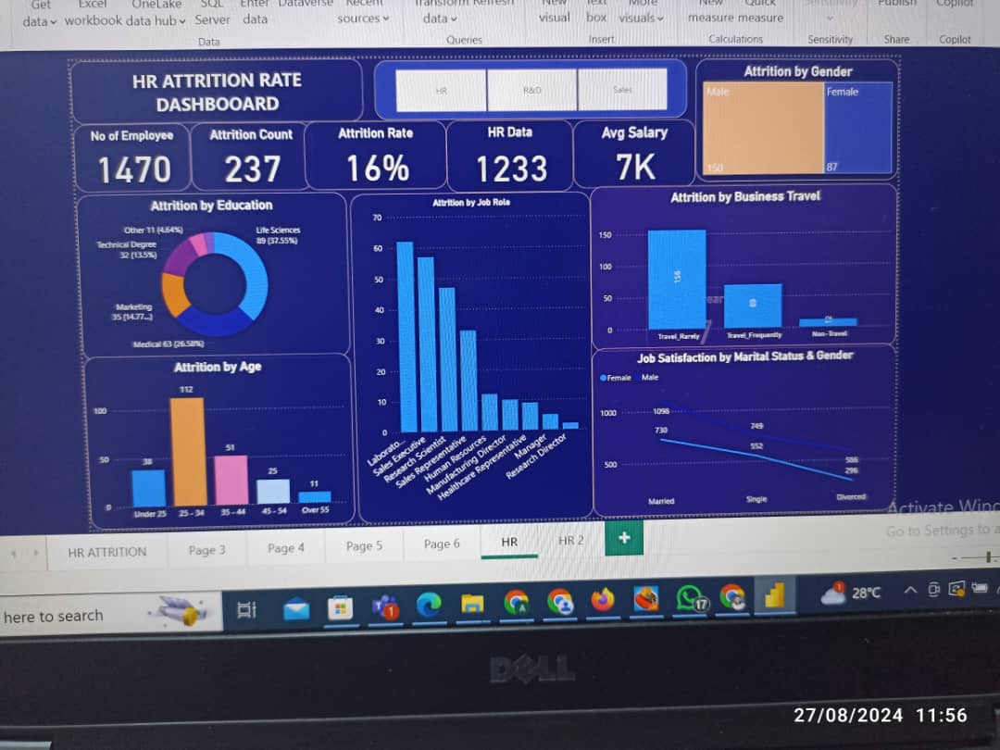

# HR-Attrition-Rate
This repository presents a comprehensive analysis of employee attrition data, providing actionable insights for HR departments. By leveraging data visualization and statistical analysis, this project identifies key factors influencing employee turnover, such as gender, education, job role, business travel, age, and job satisfaction.

## Project outline

- Data Sources

- Tools Utilized

- Data Analysis

- Data Visualization

- Key Takeaways

- Conclusion

## Data Sources

Kaggle

## Tools utilized

- Ms Excel [Download Here](www.microsoft.com)
- MS Power BI

## Data Analysis
In today's competitive job market, retaining the best staff is critical to success. I'm thrilled to share some insightful observations I made while used the potent data analysis tool Power BI to examine HR data. Overall Attrition Rate: research I conducted found an employee turnover rate of 16.12%. This indicates that out of a total of 1470 employees, 237 left the organization. This provides us with a good starting point, but for more context, it's crucial to compare it to industry benchmarks. 

## Data Visualization

## Key Takeaways

Most survey participants were aged 26 to 35. This age group had twice as many respondents (115) as all other age groups combined With 58.08%, males were the majority gender in the survey. 
- Demographic Factors: The data suggests that Male employees have a higher attrition rate than female employees,while a higher attrition rate among younger employees within the age band 25-34.
- Educational Background: Employees with Bachelor Degree Level 41.7%  have a higher percentage of leaving the organization.
- Job Role: Employees in labouratory technical service positions may experience higher turnover.
- Work-Life Balance and Job Satisfaction: Dissatisfaction with work-life balance or job satisfaction can lead to attrition.
- Compensation and Benefits: Inadequate compensation or benefits may drive employees away.
- Organizational Culture: A negative or toxic work environment can impact retention.
